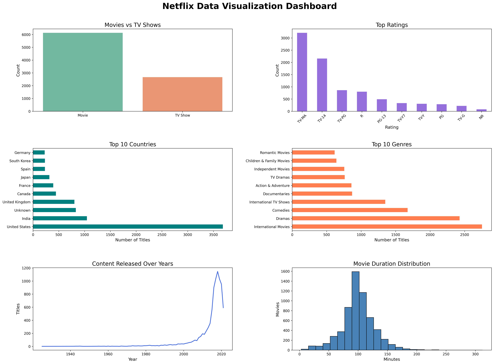

# 📊 Task 3 – Data Visualization Dashboard

A Python-based dashboard that visualizes the Netflix Titles dataset to uncover trends, content distribution, and viewing insights through informative charts.

---

## 📸 Dashboard Preview

<p align="center">
  
</p>

---

## 🚀 Project Overview

This project focuses on transforming raw Netflix data into meaningful visual insights. Using Python visualization libraries, a dashboard was created to analyze the distribution of movies and TV shows, content ratings, production countries, genres, release trends, and movie durations.

---

## 🎯 Objectives

- Analyze Netflix content using visual analytics.
- Identify content trends and distributions.
- Build a dashboard containing multiple statistical visualizations.
- Present insights in an easy-to-understand graphical format.

---

## 🛠 Technologies Used

- Python
- Pandas
- Matplotlib
- Seaborn
- VS Code

---

## 📈 Dashboard Features

- 📺 Movies vs TV Shows Distribution
- ⭐ Rating Distribution
- 🌍 Top 10 Countries with Most Content
- 🎭 Top 10 Genres
- 📅 Content Released Over the Years
- ⏱ Movie Duration Distribution

---

## 📂 Project Structure

```
Task 3 - Data Visualization/
│
├── datasets/
├── outputs/
│   └── graphs/
│       └── netflix_dashboard.png
├── screenshots/
├── dashboard.py
├── observations.md
├── requirements.txt
└── README.md
```

---

## 📚 Key Learning Outcomes

- Data Cleaning
- Exploratory Data Visualization
- Dashboard Design
- Statistical Interpretation
- Graphical Data Representation

---

## 👨‍💻 Author

**A. Hanuma Siva Prabhath**

CodeAlpha Data Analytics Internship