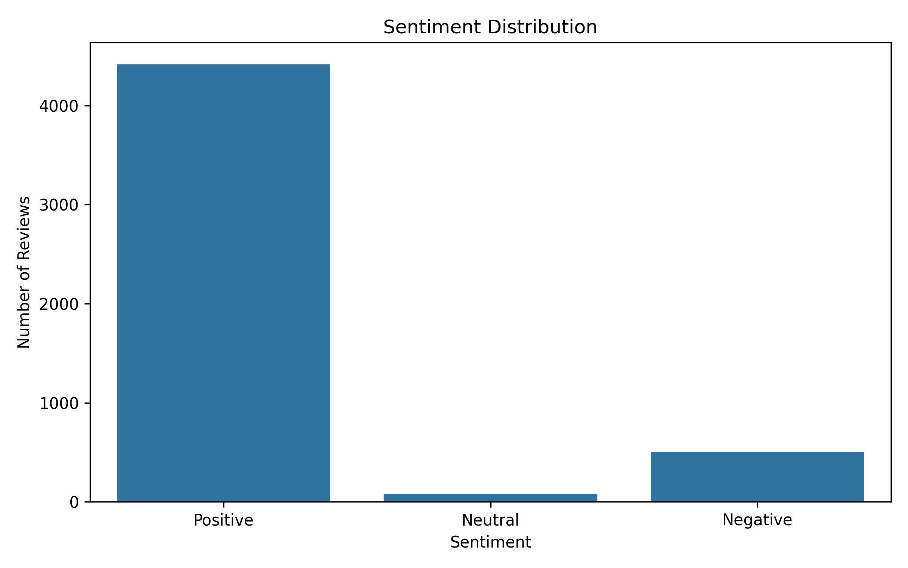
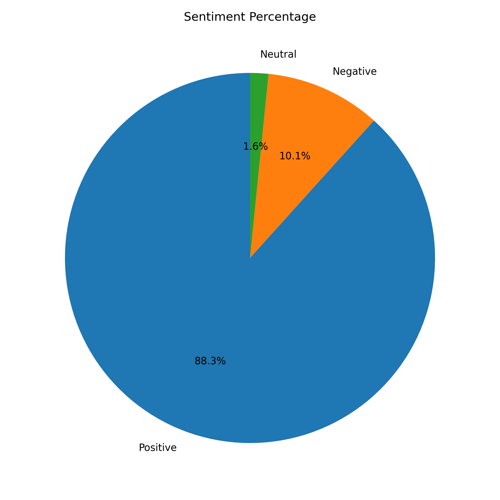
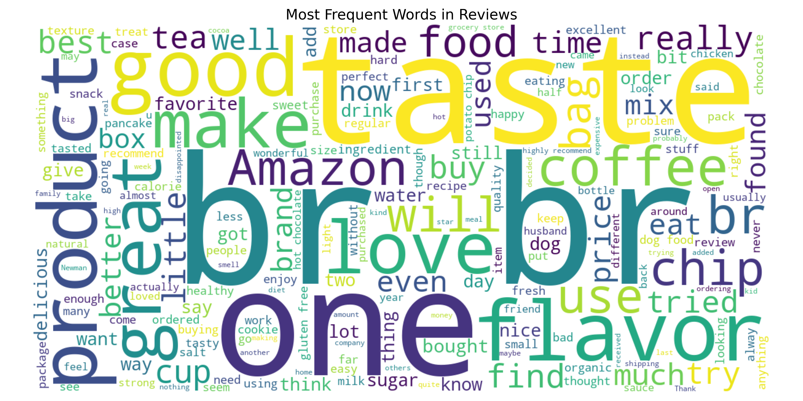

# 😊 Task 4 – Sentiment Analysis

A Natural Language Processing (NLP) project that classifies customer reviews into **Positive**, **Negative**, or **Neutral** sentiments and visualizes the results.

---

## 📸 Output Preview

<table>
<tr>
<td align="center">
<b>Sentiment Distribution</b><br>

</td>

<td align="center">
<b>Sentiment Percentage</b><br>

</td>
</tr>
</table>

<br>

<p align="center">
<b>Word Cloud</b><br><br>

</p>

---

## 🚀 Project Overview

This project performs sentiment analysis on customer reviews using TextBlob. The classified sentiments are further analyzed using charts and a word cloud to better understand customer opinions.

---

## 🎯 Objectives

- Clean customer review data.
- Perform sentiment classification.
- Visualize sentiment distribution.
- Generate meaningful insights from customer feedback.

---

## 🛠 Technologies Used

- Python
- Pandas
- TextBlob
- Matplotlib
- WordCloud
- VS Code

---

## ✨ Features

- 🧹 Data Cleaning
- 😊 Sentiment Classification
- 📊 Sentiment Distribution Analysis
- 🥧 Sentiment Percentage Pie Chart
- ☁ Word Cloud Generation
- 💬 Sample Positive Reviews
- 💬 Sample Negative Reviews

---

## 📂 Project Structure

```
Task 4 - Sentiment Analysis/
│
├── datasets/
├── outputs/
│   └── graphs/
│       ├── sentiment_distribution.png
│       ├── sentiment_pie.png
│       └── wordcloud.png
├── screenshots/
├── sentiment_analysis.py
├── observations.md
├── requirements.txt
└── README.md
```

---

## 📚 Key Learning Outcomes

- Natural Language Processing (NLP)
- Sentiment Analysis
- Text Classification
- Data Visualization
- Word Cloud Generation

---

## 👨‍💻 Author

**A. Hanuma Siva Prabhath**

CodeAlpha Data Analytics Internship